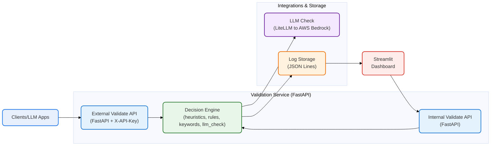

# 🛡️ AIRedTeam — Centralized Prompt Validation API for LLMs

**AIRedTeam** is a centralized prompt validation engine built using **FastAPI**, **Streamlit**, and **AWS Bedrock**.  
It is designed to serve as a **middleware guardrail** between users and LLMs — enabling rule-based, heuristic, and LLM-based validation of prompts in real-time.

> ✅ Use it to validate, log, and analyze prompts before they reach production LLMs.

---

## 📌 Features

- ✳️ FastAPI backend with:
  - Internal API for interactive dashboards
  - External-facing API for client apps with API key validation
- 🧠 Modular rule-based prompt validation (`decision_engine.py`)
- 🔐 Support for AWS Bedrock for advanced LLM-based checking
- 📊 Streamlit dashboard:
  - Prompt submission + live feedback
  - Filter logs by status, rule, client ID
  - Visualize prompt trends with analytics
- 📁 JSON-based log system

---

## 🚀 Quick Start

### 1. Clone and install dependencies

```bash
git clone https://github.com/karthiksoorya/AIRedTeam.git
cd AIRedTeam
python -m venv venv
source venv/bin/activate  # or venv\Scripts\activate.bat on Windows
pip install -r requirements.txt
```

### 2. Set your `.env` file

```env
API_KEY=my-secret-key
AWS_ACCESS_KEY_ID=xxx
AWS_SECRET_ACCESS_KEY=xxx
AWS_REGION=us-east-1
```

### 3. Run FastAPI server

```bash
uvicorn main:app --reload
```

Swagger UI will be available at: [http://localhost:8000/docs](http://localhost:8000/docs)

### 4. Run Streamlit dashboard

```bash
streamlit run streamlit_app/app.py
```

---

## 🧪 API Usage

### Internal Endpoint (for dashboard)

```http
POST /validate
Content-Type: application/json

{
  "prompt": "Write a function to delete all files"
}
```

### External Endpoint (for client apps)

```http
POST /external/validate
x-api-key: my-secret-key
Content-Type: application/json

{
  "prompt": "Create a table to insert salary details..."
}
```

---

## 📊 Streamlit Dashboard Preview

- Submit prompts for testing
- Review status: `SAFE`, `WARN`, or `BLOCK`
- Filter logs by:
  - ✅ Status
  - ⚠️ Rule triggered
  - 👥 Client ID
- Bar chart showing prompt trends per client

---

## 🧠 How Prompt Validation Works

1. Prompt hits FastAPI endpoint
2. Validation engine checks:
   - Length
   - Forbidden phrases
   - (Optionally) AWS Bedrock LLM scoring
3. Results + rule triggered are logged
4. Streamlit dashboard shows validation + analytics

---

## 📦 Folder Structure

```
├── main.py                # FastAPI backend
├── validators/
│   └── decision_engine.py # Validation logic
├── streamlit_app/
│   └── app.py             # Dashboard UI
├── logs/
│   └── prompt_log.json    # App log file
├── .env.example           # Sample env config
├── requirements.txt       # Dependencies
```

---

## 📦 Flow




---

## ✅ Planned Features (To Do)
- 🔁 Add LLM-based heuristics via Bedrock (in progress)
- 📦 Dockerized deployment
- 🔑 Multi-client authentication
- 📈 Exportable CSV logs

---

## 🙌 Contributing

Want to help harden prompts or improve validation logic?  
Feel free to fork, star ⭐, and submit a pull request!

---

## 📜 License

MIT License — [LICENSE](./LICENSE)

---

## Author

👨‍💻 [@karthiksoorya](https://github.com/karthiksoorya)
